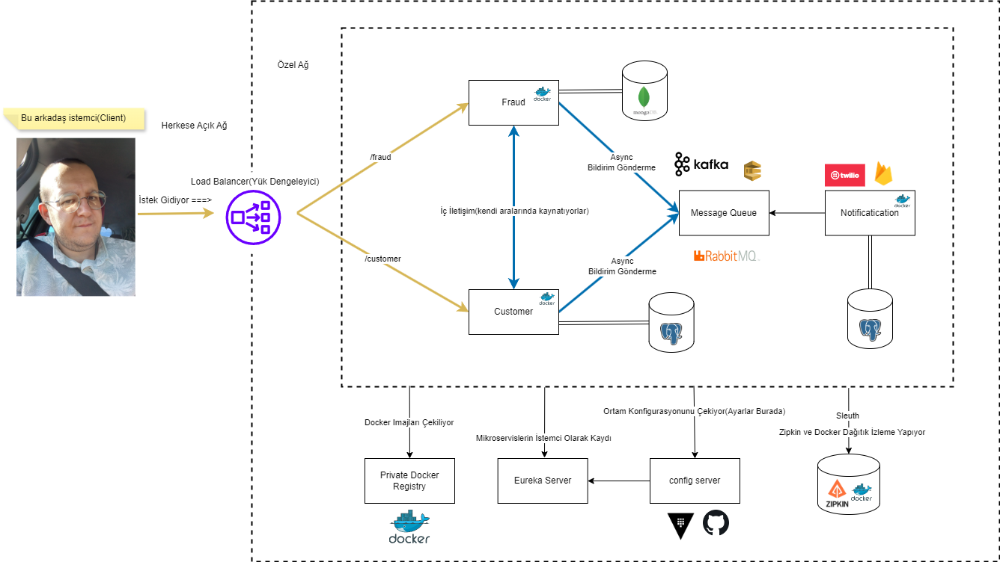

### Microservices çalışmamdır.

### Proje Özeti:
Java 17, Spring Boot, Apache Kafka, RabbitMQ, MongoDB, PostgreSQL, Docker, Docker Compose, Zipkin, Kubernetes ve AWS teknolojilerini kullanarak geliştirilen bir mikroservis projesidir. Bu proje, dağıtık bir mimari üzerinde yüksek performanslı, ölçeklenebilir ve dayanıklı bir sistem oluşturmayı hedeflemiştir.

### Microservice Proje Şeması:

### Mikroservis Mimarisi:
Proje, bağımsız olarak dağıtılabilen ve yönetilebilen mikroservislerden oluşmaktadır. Her mikroservis, belirli bir işlevi yerine getirir ve diğer mikroservislerle haberleşir.

### Veri Akışı Yönetimi:
Apache Kafka ve RabbitMQ kullanılarak yüksek hacimli veri akışı ve mesajlaşma işlemleri yönetilmiştir. Bu sayede, sistemin yüksek trafikli işlemleri sorunsuz bir şekilde karşılaması sağlanmıştır.

### Veri Depolama:
MongoDB ve PostgreSQL ile hem NoSQL hem de ilişkisel veritabanı ihtiyaçları karşılanmıştır. MongoDB, esnek veri yapıları için kullanılırken, PostgreSQL daha karmaşık ve ilişkisel veri işlemleri için tercih edilmiştir.

### Konteynerleştirme:
Docker ile mikroservisler konteynerleştirilmiş ve Docker Compose ile bu konteynerler kolayca yönetilmiştir.

### Orkestrasyon ve İzleme:
Kubernetes kullanılarak mikroservislerin orkestrasyonu sağlanmış ve Zipkin ile dağıtık izleme yapılmıştır.

### Bulut Entegrasyonu:
AWS kullanılarak projenin bulut üzerinde dağıtımı ve yönetimi gerçekleştirilmiştir. Bu sayede, sistemin ölçeklenebilirliği ve erişilebilirliği artırılmıştır.

### Projedeki Rolüm:
Proje kapsamında, yazılım geliştirme süreçlerinin yanı sıra mikroservis mimarisinin tasarımı, veri akışı ve mesajlaşma sistemlerinin entegrasyonu, veri tabanı yönetimi, konteynerleştirme ve bulut altyapısının yönetimi gibi kritik görevlerde aktif rol aldım. Ayrıca, performans izleme ve iyileştirme çalışmaları ile sistemin güvenilirliğini ve sürdürülebilirliğini sağladım.

### Görseller(Projede arayüz bulunmamaktadır.)

### Kullanılan Teknolojiler ve Araçlar:
#### •Java 17:
Modern Java özellikleri ile performans ve kod kalitesini artırmak için.
#### •Spring Boot:
Hızlı ve etkin bir şekilde mikroservisler geliştirmek için.
#### •Apache Kafka:
Yüksek verimli veri akışı ve gerçek zamanlı veri işleme için.
#### •RabbitMQ:
Mesaj kuyruğu ve asenkron iletişim sağlamak için.
#### •MongoDB:
NoSQL veri tabanı kullanarak esnek ve ölçeklenebilir veri depolama çözümleri için.
#### •PostgreSQL:
İlişkisel veri tabanı yönetimi ve karmaşık sorgular için.
#### •Docker:
Uygulamaların konteynerleştirilmesi ve her ortamda tutarlı çalışmasını sağlamak için.
#### •Docker Compose:
Çoklu konteyner uygulamalarını kolayca yönetmek için.
#### •Kubernetes:
Mikroservislerin orkestrasyonu ve otomatik ölçeklendirme için.
#### •AWS (Amazon Web Services):
Bulut altyapısı, depolama ve dağıtık sistemlerin barındırılması için.
#### •API Gateway:
Giriş kapısı olarak kullanılarak gelen istekleri yönlendirmek ve güvenlik sağlamak için kullanıldı.
#### •Load Balancer:
Yük dengesini sağlamak ve hizmet kesintilerini en aza indirmek için kullanıldı.
#### •Fraud Service:
Dolandırıcılık algılama ve önleme hizmeti olarak kullanıldı, müşteri işlemlerinde güvenliği artırmak için entegre edildi.
#### •Customer Service:
Müşteri verilerini yönetmek ve işlemleri gerçekleştirmek için kullanıldı.
#### •Private Docker Registry:
Güvenlik ve özel depolama ihtiyaçlarını karşılamak için kullanıldı, konteyner tabanlı uygulama dağıtımını yönetmek için kullanıldı.
#### •Eureka Server:
Servis keşfi ve yük dengeleme için kullanıldı, hizmetlerin otomatik olarak bulunmasını ve yönlendirilmesini sağladı.
#### •Config Server:
Uygulama yapılandırma yönetimi için kullanıldı, dinamik yapılandırma değişikliklerini kolaylaştırdı.
#### •Zipkin:
Dağıtılmış sistemlerdeki hizmetler arası etkileşimleri izlemek ve analiz etmek için kullanıldı, performans sorunlarını tespit etmek ve geliştirmek için kullanıldı.

### Proje Detayları:
Bu projede, bir dizi önde gelen teknolojiyi kullanarak kapsamlı bir altyapı geliştirdim. Bu altyapı, API yönlendirme ve güvenliği için bir giriş kapısı sağladı, yük dengesi sağlayarak hizmet kesintilerini minimize etti, müşteri işlemlerinde dolandırıcılığı tespit etmek ve önlemek için bir mikro hizmet entegre ettim, konteyner tabanlı uygulama dağıtımını yönetmek için özel Docker Compose'u kullandım, servis keşfi(discovery) ve yük dengeleme için bir Eureka sunucusu entegre ettim, uygulama yapılandırma yönetimi için bir Yapılandırma Sunucusu(config server) kurdum ve dağıtılmış sistemlerdeki hizmetler arası etkileşimleri izlemek ve analiz etmek için Zipkin'i kullandım.
